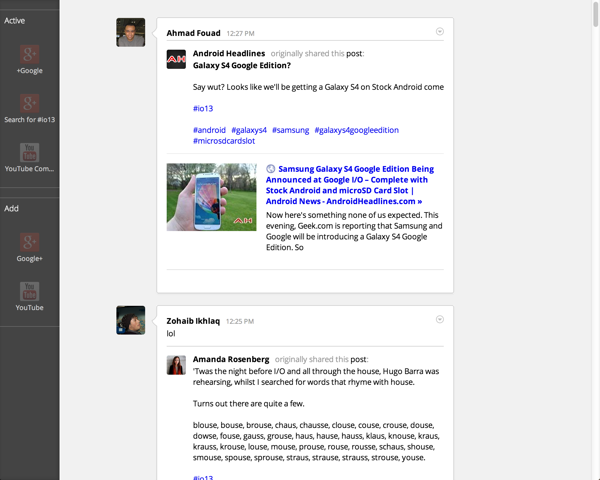

streamwatch
===========

A simple web page that allows simultaneous watching of multipleinformation
sources in a Google+ stream-like style. This app was created for the I/O
Extended Event in Aachen, Germany. It is inspired by [Gerwin
Sturm](goo.gl/xsMuK)'s [Hangout Comment Tracker](goo.gl/uBXnS) and built using
the [Google Closure Tools](goo.gl/O9sx2).

Most of the rendering code was originally developed for the [Favorite Posts for
Google+](goo.gl/4werF) Chrome Extension, thus strongly resembling the look of a
Google+ stream.

How to use
----------

1. Make sure you've got Java and Python installed.
2. Build the application script by running ./tools/build.sh (if it doesn't work,
   try `cd`ing into the root directory of the repository)
3. Either upload `index.html`, `js/streamwatch.min.js` as well as the `css` and
   `img` folder to your server, or run the application locally by calling
   `python -m SimpleHTTPServer` from your terminal. You can then access the
   application at http://localhost:8000
4. Don't forget to set your Google+ API Key in `index.html`
5. Add all the data sources you want using the sidebar on the left. You can hide
	 the sidebar by pressing the `s` key. Posts will automagically appear

Screenshot
----------

